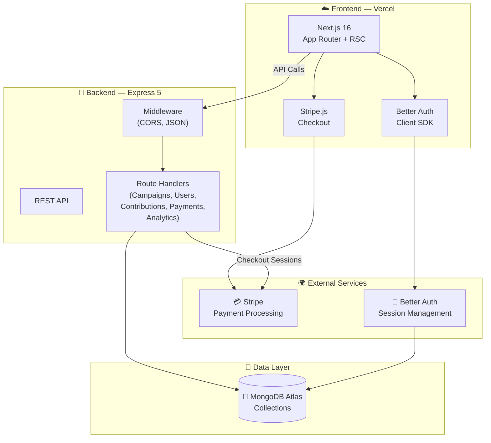

<div align="center">

# 🚀 FundForge

### Empowering Innovations. Funding the Future.

A **production-grade** crowdfunding platform with multi-role authentication, Stripe-powered contributions, role-specific dashboards, and a sleek dark-mode UI.

&nbsp;

[](https://nextjs.org/)
[](https://react.dev/)
[](https://tailwindcss.com/)
[](https://www.mongodb.com/)
[](https://stripe.com/)
[](https://expressjs.com/)
[](https://www.better-auth.com/)
[](https://heroui.com/)

&nbsp;

🌍 [**Live Demo**](https://fund-forge-client.vercel.app/) &nbsp;·&nbsp; 📦 [**Client Repo**](https://github.com/ashiqurrhmn/FundForge-client) &nbsp;·&nbsp; 🔌 [**Server Repo**](https://github.com/ashiqurrhmn/FundForge-server)

</div>

---

## 📖 Table of Contents

- [Overview](#-overview)
- [Screenshots](#-screenshots)
- [Why FundForge Stands Out](#-why-fundforge-stands-out)
- [Demo Accounts](#-demo-accounts)
- [Tech Stack](#-tech-stack)
- [Key Features](#-key-features)
- [Roadmap](#-roadmap)
- [Architecture](#-architecture)
- [Project Structure](#-project-structure)
- [Getting Started](#-getting-started)
- [Environment Variables](#-environment-variables)
- [Deployment](#-deployment)
- [API Endpoints Reference](#-api-endpoints-reference)
- [Contributing](#-contributing)
- [License](#-license)
- [Author](#-author)

---

## 🎯 Overview

**FundForge** is a fully-featured crowdfunding ecosystem connecting **Supporters**, **Creators**, and **Platform Admins** through a modern, responsive web experience. Built with Next.js 16's App Router and React Server Components on the frontend, backed by an Express 5 REST API and MongoDB, it delivers a complete fundraising ecosystem — from discovering creative projects and one-click contributions to wallet management and admin oversight.

---

## 📸 Screenshots


---

## ✨ Why FundForge Stands Out

| | Feature | Description |
|---|---|---|
| 💳 | **Stripe Integration** | Securely buy credits and fund campaigns seamlessly through Stripe Checkout |
| 🔐 | **Better Auth Integration** | Seamless email/password and Google social auth with MongoDB adapter and session management |
| 👥 | **Multi-Role RBAC** | Three distinct roles — Supporter, Creator, Admin — each with isolated dashboards and permissions |
| 📊 | **Analytics Dashboards** | Interactive Recharts visualizations: funding trends, campaign performance, and platform stats |
| 🏢 | **Campaign Approval Workflow** | Creators submit campaigns → Admin reviews & approves → Only then can campaigns go live |
| 🎨 | **Dark-Mode Glassmorphism UI** | Premium dark aesthetic with ambient glows, gradient accents, and smooth Framer Motion animations |
| ⚡ | **React Compiler + RSC** | Next.js 16 with React 19, React Compiler enabled, and Server Components for blazing-fast page loads |
| 🔍 | **Smart Campaign Discovery** | Filter campaigns by category, search by keywords, and sort by funding goal or deadline |

---

## 🔑 Demo Accounts

Experience the platform from different perspectives using these test accounts:

**🧑💼 Supporter**
- **Email:** `user@gmail.com`
- **Password:** `12345Asdf`

**🎨 Creator**
- **Email:** `micro@gmail.com`
- **Password:** `12345Asdf`

**🛡️ Admin**
- **Email:** `admin@gmail.com`
- **Password:** `12345Asdf`

---

## 🔧 Tech Stack

### Frontend

| Technology | Version | Purpose |
|---|---|---|
| **Next.js** | 16 | App Router, React Server Components, API Routes |
| **React** | 19 | UI library with concurrent features + React Compiler |
| **Tailwind CSS** | v4 | Utility-first responsive styling |
| **HeroUI** | 3.x | Accessible, beautiful component library |
| **Framer Motion** | 12.x | Page transitions, hover effects, micro-animations |
| **Better Auth** | 1.6+ | Authentication with MongoDB adapter |
| **Recharts** | 3.x | Interactive data visualization for dashboards |
| **Stripe.js** | 9.x | Client-side Stripe Checkout integration |
| **Swiper** | 14.x | Smooth touch-enabled testimonial sliders |

### Backend

| Technology | Version | Purpose |
|---|---|---|
| **Node.js + Express** | 5.x | High-performance REST API server |
| **MongoDB** | 7.x | NoSQL database via native driver (no ORM overhead) |
| **Stripe SDK** | Latest | Server-side payment processing & checkout sessions |
| **CORS + Dotenv** | Latest | Middleware and environment configuration |

---

## 🔑 Key Features

### 🔒 Authentication & Authorization
- Email/password registration and Google Sign-in via **Better Auth**
- Role selection at signup: **Supporter** or **Creator**
- Admin role management (promote/demote users)
- Secure session handling with MongoDB-backed persistence
- Route protection with role-based redirects

### 🔍 Campaign Discovery & Browsing
- Full-text search by **keyword** and dynamic **category filtering**
- Visually stunning Bento-grid layouts for campaign display
- Dedicated campaign detail pages showing funding progress, deadlines, and creator info
- Smooth scroll animations using Framer Motion
- Smart duplicate contribution prevention

### 💳 Funding & Payments
- Supporter wallet system using Platform Credits (Cr)
- Secure credit purchases via Stripe Checkout sessions
- One-click contribution to live campaigns
- Automated campaign progress updates upon successful funding
- Contribution history tracking

### 📊 Role-Specific Dashboards

**🧑💼 Supporter Dashboard**
- Contribution history with status tracking
- Wallet credit balance management
- Payment history via Stripe
- Discovery recommendations based on top categories

**🎨 Creator Dashboard**
- Full CRUD for campaign creation and management (create, edit, update status)
- Track total funds raised and pending contributions
- Analytics: campaign views, funding over time, and backer metrics
- Withdrawal management for successful campaigns
- Revenue & performance charts via Recharts

**🛡️ Admin Dashboard**
- Platform-wide statistics: total users, active campaigns, total funds raised
- Campaign moderation workflow (Approve/Reject)
- User management: role changes, account deletion
- Campaign moderation: status updates, removal
- Growth analytics: 7-day user & campaign creation trends
- Payment and withdrawal oversight

### 💅 UI/UX & Design
- **Dark-mode first** design with `#000` base and zinc surfaces
- Glassmorphic navbar and cards with `backdrop-blur-md`
- Ambient gradient glows with animated orbs (Framer Motion)
- Responsive across all breakpoints (mobile → tablet → desktop)
- Floating search bar with keyword + category inputs
- Loading skeletons for every dashboard page
- Custom 404 and error pages

---

## 🗺️ Roadmap

- [ ] **Webhooks Integration:** Instant notifications for campaign creators upon new contributions.
- [ ] **Community Comments:** Allow supporters to interact and leave comments on campaigns.
- [ ] **Social Sharing:** Built-in sharing tools for X (Twitter), Facebook, and LinkedIn.
- [ ] **Creator Verification:** KYC integration for increased supporter trust.
- [ ] **Multi-Currency Support:** Auto-conversion for global campaign contributions.

---

## 🏗️ Architecture



### Database Collections

| Collection | Purpose |
|---|---|
| `user` | User accounts with roles & wallet balance (managed by Better Auth) |
| `campaigns` | Campaign listings with status, category, creator association, and funding goals |
| `contributions` | Records linking supporters to campaigns and tracking amounts |
| `payments` | Stripe payment records for credit purchases |
| `withdrawals` | Creator withdrawal requests and status |
| `campaignViews` | Analytics: tracks campaign page views |

---

## 📁 Project Structure

```
FundForge-client/
├── src/
│   ├── app/
│   │   ├── api/                    # Next.js API routes
│   │   │   ├── auth/               # Better Auth handler
│   │   │   └── stripe/             # Stripe checkout creation
│   │   ├── (dashboard)/            # Role-based dashboards
│   │   │   ├── admin/              # Admin dashboard + sub-pages
│   │   │   │   ├── campaigns/      # Campaign moderation
│   │   │   │   ├── payments/       # Payment oversight
│   │   │   │   └── users/          # User management
│   │   │   ├── creator/            # Creator dashboard + sub-pages
│   │   │   │   ├── campaigns/      # Campaign CRUD
│   │   │   │   ├── withdrawals/    # Withdrawal management
│   │   │   │   └── settings/       # Account settings
│   │   │   └── supporter/          # Supporter dashboard + sub-pages
│   │   │       ├── contributions/  # My contributions
│   │   │       ├── wallet/         # Wallet management
│   │   │       └── settings/       # Account settings
│   │   ├── explore/                # Campaign catalog + detail pages
│   │   │   └── [id]/               # Dynamic campaign detail route
│   │   ├── login/                  # Sign-in page
│   │   ├── signup/                 # Sign-up page
│   │   ├── unauthorized/           # 403 redirect page
│   │   ├── layout.tsx              # Root layout with providers
│   │   ├── page.tsx                # Landing page
│   │   ├── not-found.tsx           # Custom 404
│   │   └── error.tsx               # Error boundary
│   ├── components/
│   │   ├── dashboard/              # Dashboard-specific components
│   │   ├── categories-section.tsx  # Campaign categories
│   │   ├── featured-campaigns.tsx  # Featured listings
│   │   └── testimonial-section.tsx # User testimonials
│   └── lib/                        # Utilities & Config
│       ├── actions/                # Server actions
│       ├── api/                    # API client functions
│       ├── auth.ts                 # Better Auth server config
│       ├── auth-client.ts          # Better Auth client hooks
│       └── stripe.ts               # Stripe config
├── public/                         # Static assets
└── package.json
```

```
FundForge-server/
├── index.js                        # Express 5 API (all routes)
├── package.json
└── .env                            # Environment variables
```

---

## 🚀 Getting Started

### Prerequisites

- **Node.js** v18+ (v22 recommended)
- **MongoDB** cluster ([MongoDB Atlas](https://www.mongodb.com/atlas) recommended)
- **Stripe Account** with API keys ([stripe.com](https://stripe.com))

### Installation

```bash
# ── 1. Clone both repositories ──────────────────────────────

git clone https://github.com/ashiqurrhmn/FundForge-client.git
git clone https://github.com/ashiqurrhmn/FundForge-server.git

# ── 2. Set up the Backend ───────────────────────────────────

cd FundForge-server
npm install

# Create .env file (see Environment Variables section below)

# Start the server
npm start
# → Server runs on http://localhost:5000

# ── 3. Set up the Frontend ──────────────────────────────────

cd ../FundForge-client
npm install

# Create .env file (see Environment Variables section below)

# Start development server
npm run dev
# → Frontend runs on http://localhost:3000
```

---

## 🔐 Environment Variables

### Frontend (`FundForge-client/.env`)

```env
# MongoDB connection (used by Better Auth)
MONGODB_URI=mongodb+srv://<user>:<password>@<cluster>.mongodb.net
AUTH_DB_NAME=dbname

# Better Auth
BETTER_AUTH_SECRET=your-secret-key
BETTER_AUTH_URL=http://localhost:3000

# Backend API URL
NEXT_PUBLIC_API_URL=http://localhost:5000

# Stripe
STRIPE_SECRET_KEY=sk_test_...
NEXT_PUBLIC_STRIPE_PUBLISHABLE_KEY=pk_test_...
```

### Backend (`FundForge-server/.env`)

```env
# MongoDB
MONGODB_URI=mongodb+srv://<user>:<password>@<cluster>.mongodb.net
DB_NAME=dbname

# CORS
CLIENT_URL=http://localhost:3000

# Server
PORT=5000
```

---

## 🌐 Deployment

| Service | Purpose | Details |
|---|---|---|
| **Vercel** | Next.js Frontend | Auto-deploy from GitHub, edge-optimized |
| **Node.js Hosting** | Express API Server | Any Node.js host (Render, Railway, VPS) |
| **MongoDB Atlas** | Database | Cloud-hosted NoSQL with free tier |
| **Stripe** | Payments | Test mode for development, live keys for production |

### Deploy Frontend to Vercel

```bash
# Install Vercel CLI
npm i -g vercel

# Deploy
vercel --prod
```

> **Note**: Set all frontend environment variables in the Vercel dashboard under **Settings → Environment Variables**.

---

## 🗺️ API Endpoints Reference

| Method | Endpoint | Description |
|---|---|---|
| `GET` | `/api/users` | List all users (filterable by role) |
| `PATCH` | `/api/users/:id/role` | Update user role (Admin) |
| `DELETE` | `/api/users/:id` | Delete a user (Admin) |
| `GET` | `/api/campaigns` | List campaigns (filterable by creator, status) |
| `GET` | `/api/campaigns/:id` | Get single campaign details |
| `POST` | `/api/campaigns` | Create new campaign (Creator) |
| `PUT` | `/api/campaigns/:id` | Update a campaign listing |
| `PATCH` | `/api/campaigns/:id/status` | Update campaign status (Admin) |
| `DELETE` | `/api/campaigns/:id` | Delete a campaign (Admin) |
| `POST` | `/api/contributions` | Submit contribution |
| `GET` | `/api/contributions` | List contributions (filterable) |
| `POST` | `/api/payments` | Create payment record |
| `GET` | `/api/payments` | Get user payments |
| `POST` | `/api/withdrawals` | Request withdrawal (Creator) |
| `GET` | `/api/withdrawals` | Get withdrawal requests |

---

## 🤝 Contributing

Contributions, issues, and feature requests are welcome!

1. Fork the project
2. Create your feature branch (`git checkout -b feature/AmazingFeature`)
3. Commit your changes (`git commit -m 'Add some AmazingFeature'`)
4. Push to the branch (`git push origin feature/AmazingFeature`)
5. Open a Pull Request

---

## 📜 License

Distributed under the MIT License. See `LICENSE` for more information.

---

## 👤 Author

<div align="center">

**Built with 🔥 by [Md. Ashiqur Rahman](https://ashiqur-portfolio0.vercel.app/)**

&nbsp;

[](https://ashiqur-portfolio0.vercel.app/)
[](https://github.com/ashiqurrhmn)
[](https://www.linkedin.com/in/ashiqur-rahman00/)
[](mailto:ashiqur1312@gmail.com)

</div>

---

<div align="center">

### ⭐ If you found this helpful, give it a star!

**Built with ❤️ using Next.js 16, Express 5, MongoDB, and Stripe**

&nbsp;

[](https://github.com/ashiqurrhmn/FundForge-client)
[](https://github.com/ashiqurrhmn/FundForge-server)

&nbsp;

<sub>© 2026 FundForge. All rights reserved.</sub>

</div>
